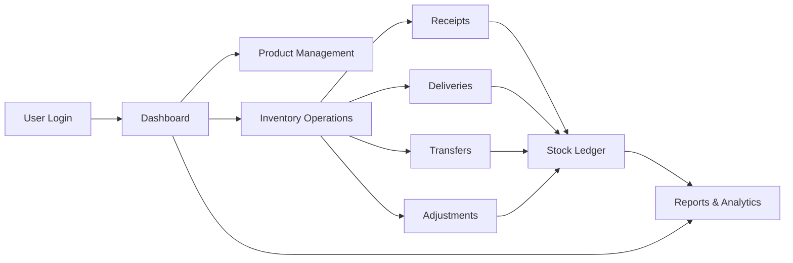

# 📦 StockMaster - Inventory Management System

StockMaster is a modern, real-time inventory management system designed to streamline stock operations for businesses. It replaces manual tracking methods with a centralized, easy-to-use application that supports multiple warehouses and provides comprehensive inventory control.

## 🎯 Project Overview

StockMaster digitizes and automates all inventory-related operations, providing:
- **Real-time stock tracking** across multiple locations
- **Automated inventory operations** (receipts, deliveries, transfers, adjustments)
- **Comprehensive reporting** and dashboard analytics
- **Role-based access control** for different user types

### 👥 Target Users
- **Inventory Managers** - Oversee all stock operations and management
- **Warehouse Staff** - Execute daily operations like transfers and adjustments

## 🎥 Demo Video

Watch the complete demonstration: [StockMaster Demo Video](https://drive.google.com/file/d/1G-EU1RKJKLNpsuUqNmYnsqhS1i7xmhT6/view?usp=sharing)

## 🚀 Core Features

### 🔐 Authentication & Security
- User registration and login
- OTP-based password reset
- JWT-based authentication
- Role-based access control

### 📊 Dashboard
- Real-time KPIs and metrics
- Total products in stock
- Low stock alerts
- Pending receipts and deliveries
- Scheduled internal transfers
- Dynamic filtering by document type, status, warehouse, and category

### 📦 Product Management
- Create and update products with SKU, category, unit of measure
- Stock availability per location
- Product categorization
- Reordering rules and alerts

### 🔄 Inventory Operations
| Operation | Purpose | Stock Impact |
|-----------|---------|--------------|
| **Receipts** | Incoming goods from suppliers | Increases stock |
| **Delivery Orders** | Outgoing goods to customers | Decreases stock |
| **Internal Transfers** | Movement between locations | Updates location only |
| **Stock Adjustments** | Correct inventory discrepancies | Updates to physical count |

## 🔄 System Workflow



### 🏢 Warehouse & Location Management
- Create and manage multiple warehouses
- Define storage locations (shelves, racks, zones)
- Track stock at granular location level
- Location-based stock queries

### 📊 Stock Management
- Real-time stock levels per location
- View stock across all warehouses
- Track on-hand vs available quantities
- Stock valuation with cost tracking

### 📈 Move History & Analytics
- Complete audit trail of all operations
- Kanban board visualization with drag-and-drop
- Filter by operation type, status, date
- Track who performed which operation and when

## 🛠 Tech Stack

### Frontend
- **React 18** with TypeScript
- **Vite** for fast development and building
- **Tailwind CSS** + **shadcn/ui** for styling
- **React Router** for navigation
- **TanStack Query** for data fetching and caching
- **@dnd-kit** for drag-and-drop functionality
- **ESLint + TypeScript** for code quality

### Backend
- **Node.js + Express** - RESTful API server
- **PostgreSQL** - Relational database
- **JWT** - Secure authentication
- **bcryptjs** - Password hashing
- **pg** - PostgreSQL client for Node.js

## 📁 Project Structure

```
spit-stockflow/
├── backend/
│   ├── src/
│   │   ├── config/
│   │   │   ├── database.js       # PostgreSQL connection
│   │   │   └── schema.js         # Database schema
│   │   ├── controllers/
│   │   │   ├── authController.js
│   │   │   ├── dashboardController.js
│   │   │   ├── locationController.js
│   │   │   ├── operationController.js
│   │   │   ├── productController.js
│   │   │   ├── stockController.js
│   │   │   └── warehouseController.js
│   │   ├── middleware/
│   │   │   ├── auth.js           # JWT authentication
│   │   │   └── validate.js       # Request validation
│   │   ├── routes/
│   │   │   ├── authRoutes.js
│   │   │   ├── dashboardRoutes.js
│   │   │   ├── locationRoutes.js
│   │   │   ├── operationRoutes.js
│   │   │   ├── productRoutes.js
│   │   │   ├── stockRoutes.js
│   │   │   └── warehouseRoutes.js
│   │   ├── scripts/
│   │   │   ├── initDb.js         # Database initialization
│   │   │   └── seedData.js       # Sample data seeding
│   │   └── server.js             # Express server entry point
│   ├── .env.example
│   └── package.json
│
├── frontend/
│   ├── public/
│   │   └── robots.txt
│   ├── src/
│   │   ├── components/
│   │   │   ├── layout/
│   │   │   │   ├── AppLayout.tsx
│   │   │   │   ├── AppSidebar.tsx
│   │   │   │   └── TopBar.tsx
│   │   │   ├── ui/              # shadcn/ui components
│   │   │   │   ├── button.tsx
│   │   │   │   ├── card.tsx
│   │   │   │   ├── dialog.tsx
│   │   │   │   ├── input.tsx
│   │   │   │   ├── table.tsx
│   │   │   │   └── ... (40+ UI components)
│   │   │   ├── NavLink.tsx
│   │   │   ├── ProtectedRoute.tsx
│   │   │   └── StatusPill.tsx
│   │   ├── hooks/
│   │   │   ├── use-mobile.tsx
│   │   │   └── use-toast.ts
│   │   ├── lib/
│   │   │   ├── api.ts           # Axios configuration
│   │   │   ├── auth.ts
│   │   │   ├── authService.ts
│   │   │   ├── dashboardService.ts
│   │   │   ├── locationService.ts
│   │   │   ├── operationService.ts
│   │   │   ├── permissions.ts   # Role-based access
│   │   │   ├── productService.ts
│   │   │   ├── stockService.ts
│   │   │   ├── utils.ts
│   │   │   └── warehouseService.ts
│   │   ├── pages/
│   │   │   ├── Adjustments.tsx
│   │   │   ├── Dashboard.tsx
│   │   │   ├── Deliveries.tsx
│   │   │   ├── ForgotPassword.tsx
│   │   │   ├── Locations.tsx
│   │   │   ├── Login.tsx
│   │   │   ├── MoveHistory.tsx
│   │   │   ├── NotFound.tsx
│   │   │   ├── Products.tsx
│   │   │   ├── Profile.tsx
│   │   │   ├── Receipts.tsx
│   │   │   ├── Signup.tsx
│   │   │   ├── Stock.tsx
│   │   │   ├── Transfers.tsx
│   │   │   └── Warehouses.tsx
│   │   ├── App.tsx
│   │   ├── main.tsx
│   │   └── index.css
│   ├── .env.example
│   ├── components.json
│   ├── index.html
│   ├── package.json
│   ├── tailwind.config.ts
│   ├── tsconfig.json
│   └── vite.config.ts
│
├── PRESENTATION_SCRIPT.md
└── README.md
```

## ⚡ Quick Start

### Prerequisites
- **Node.js 18+** - [Download](https://nodejs.org/)
- **PostgreSQL 14+** - [Download](https://www.postgresql.org/download/)
- **npm** or **bun** (package manager)

### PostgreSQL Installation & Setup

#### For macOS:
```bash
# Using Homebrew
brew install postgresql@14
brew services start postgresql@14

# Create database
psql postgres
CREATE DATABASE stockmaster_db;
\q
```

#### For Windows:
1. Download PostgreSQL installer from [postgresql.org](https://www.postgresql.org/download/windows/)
2. Run the installer and follow the setup wizard
3. Remember the password you set for the `postgres` user
4. Open pgAdmin or command prompt and create database:
```sql
CREATE DATABASE stockmaster_db;
```

#### For Linux (Ubuntu/Debian):
```bash
sudo apt update
sudo apt install postgresql postgresql-contrib
sudo systemctl start postgresql
sudo systemctl enable postgresql

# Create database
sudo -u postgres psql
CREATE DATABASE stockmaster_db;
\q
```

### Installation

1. **Clone the repository**
```bash
git clone https://github.com/AnishBandal/spit-stockflow.git
cd spit-stockflow
```

2. **Backend Setup**
```bash
cd backend

# Install dependencies
npm install

# Configure environment variables
cp .env.example .env
# Edit .env with your database credentials:
# DB_USER=postgres
# DB_HOST=localhost
# DB_NAME=stockmaster_db
# DB_PASSWORD=your_password
# DB_PORT=5432
# JWT_SECRET=your_secret_key
# PORT=5001

# Initialize database schema
node src/scripts/initDb.js

# (Optional) Seed sample data
node src/scripts/seedData.js

# Start backend server
npm run dev
```

Backend will run at `http://localhost:5001`

3. **Frontend Setup**

Open a new terminal:

```bash
cd frontend

# Install dependencies
npm install
# or using bun
bun install

# Configure environment variables
cp .env.example .env
# Edit .env:
# VITE_API_URL=http://localhost:5001/api

# Start frontend development server
npm run dev
# or
bun dev
```

Frontend will run at `http://localhost:8081`

4. **Access the Application**

Open your browser and navigate to `http://localhost:8081`

**Demo Accounts:**
- **Manager Account**
  - Email: `demo.manager@stockmaster.test`
  - Password: `password123`
  
- **Staff Account**
  - Email: `staff@stockmaster.test`
  - Password: `password123`

### Build for Production

**Frontend:**
```bash
cd frontend
npm run build
npm run preview  # Preview production build
```

**Backend:**
```bash
cd backend
# Set NODE_ENV=production in .env
npm start
```

## 🗃 Database Schema Overview

The system uses PostgreSQL with these main tables:

### Core Tables
- **users** - Authentication, profiles, and role management
- **products** - Product catalog with SKU, category, and units
- **warehouses** - Warehouse master data with contact info
- **locations** - Storage locations within warehouses (shelves, racks, zones)
- **stock** - Current stock levels per product per location
- **operations** - All inventory operations (receipts, deliveries, transfers, adjustments)
- **operation_items** - Line items for each operation
- **move_history** - Complete audit trail of all stock movements
- **otps** - One-time passwords for password reset

### Key Relationships
- Products can exist in multiple locations across warehouses
- Operations have many operation_items (line items)
- Each stock movement is logged in move_history
- Locations belong to warehouses
- Users have roles (Inventory Manager, Warehouse Staff)


## 📱 Key Pages & Features

### For Inventory Managers (Full Access)
1. **Dashboard** - Real-time KPIs, recent operations, low stock alerts
2. **Products** - Create, update, view product catalog
3. **Warehouses** - Manage warehouse locations and details
4. **Locations** - Define and organize storage locations
5. **Stock** - View and edit stock levels across all locations
6. **Receipts** - Manage incoming goods from suppliers
7. **Deliveries** - Process outgoing shipments to customers
8. **Transfers** - Internal stock movements between locations
9. **Adjustments** - Stock corrections and cycle counting
10. **Move History** - Complete audit trail with Kanban board

### For Warehouse Staff (Limited Access)
1. **Dashboard** - View-only KPIs and operations overview
2. **Stock** - View current inventory levels (read-only)
3. **Transfers** - Create and manage internal transfers
4. **Adjustments** - Record stock count corrections
5. **Move History** - View transaction history

### Security Features
- Role-based access control (RBAC)
- JWT authentication with token expiration
- Password reset via OTP
- Bcrypt password hashing
- Protected routes at UI and API level

## 🎨 UI/UX Features

- **Responsive Design** - Fully responsive interface for desktop, tablet, and mobile
- **shadcn/ui Components** - Professional, accessible UI components
- **Dark Mode Support** - System-wide theme toggle
- **Real-time Updates** - Instant stock level changes across operations
- **Intuitive Search & Filters** - Quick data exploration across all pages
- **Status Indicators** - Color-coded status pills for quick identification
- **Drag-and-Drop Kanban** - Visual workflow management in Move History
- **Toast Notifications** - User feedback for all actions
- **Form Validation** - Client and server-side validation
- **Loading States** - Clear feedback during data operations

## 🔧 Development & Architecture

### Frontend Architecture
- **TypeScript** - Type-safe code for fewer runtime errors
- **Component-based** - Reusable, maintainable UI components
- **Service Layer** - Centralized API calls with error handling
- **Protected Routes** - Client-side route guards based on roles
- **TanStack Query** - Efficient data fetching and caching

### Backend Architecture
- **RESTful API** - Standard HTTP methods and status codes
- **MVC Pattern** - Separation of concerns (Models, Controllers, Routes)
- **Middleware** - Authentication and validation layers
- **Database Transactions** - Atomic operations for data consistency
- **Role-based Middleware** - Server-side authorization checks

### Database Design
- **Normalized Schema** - Efficient storage with proper relationships
- **Indexed Columns** - Fast queries on frequently searched fields
- **Foreign Keys** - Data integrity through constraints
- **Triggers & Functions** - Automated stock updates and audit logging

## 🐛 Troubleshooting

### Common Issues

**Database Connection Error:**
```bash
# Check if PostgreSQL is running
# macOS:
brew services list | grep postgresql

# Linux:
sudo systemctl status postgresql

# Windows: Check Services app for "postgresql" service

# Verify database exists:
psql -U postgres -l
```

**Port Already in Use:**
```bash
# Backend (5001)
lsof -ti:5001 | xargs kill -9

# Frontend (8081)
lsof -ti:8081 | xargs kill -9
```

**Frontend Can't Connect to Backend:**
- Ensure backend is running on port 5001
- Check `.env` file in frontend has correct `VITE_API_URL`
- Verify no CORS issues in browser console

**Database Schema Issues:**
```bash
# Re-initialize database
cd backend
node src/scripts/initDb.js
```

## 📝 API Documentation

### Base URL
```
http://localhost:5001/api
```

### Authentication Endpoints
- `POST /auth/register` - Create new user account
- `POST /auth/login` - User login
- `POST /auth/request-otp` - Request password reset OTP
- `POST /auth/verify-otp` - Verify OTP code
- `POST /auth/reset-password` - Reset password with verified OTP
- `GET /auth/me` - Get current user info (requires JWT)

### Inventory Endpoints
- `GET /products` - List all products
- `POST /products` - Create new product
- `PUT /products/:id` - Update product
- `DELETE /products/:id` - Delete product
- `GET /warehouses` - List warehouses
- `POST /warehouses` - Create warehouse
- `GET /locations` - List storage locations
- `POST /locations` - Create location
- `GET /stock` - Get stock levels
- `PUT /stock/:id` - Update stock quantity
- `GET /operations` - List all operations
- `POST /operations` - Create operation (receipt/delivery/transfer/adjustment)
- `PUT /operations/:id` - Update operation
- `GET /dashboard/stats` - Get dashboard KPIs

## 🤝 Contributing

Contributions are welcome! Please follow these guidelines:

1. Fork the repository
2. Create a feature branch (`git checkout -b feature/new-feature`)
3. Commit your changes (`git commit -m 'Add new feature'`)
4. Push to the branch (`git push origin feature/new-feature`)
5. Open a Pull Request

## 📄 License

This project is licensed under the MIT License.

## 👨‍💻 Authors

- **Anish Bandal** - [@AnishBandal](https://github.com/AnishBandal)
- **Harsh Pawar** - [@HarshPawar](https://github.com/HarshPawar-07)
- **Swati Mane** - [@SwatiMane](https://github.com/swatimane02)
- **Priti Chavan** - [@PritiChavan](https://github.com/priti2107)


  

## 🙏 Acknowledgments

- Built for SPIT Hackathon 2025
- Inspired by real-world inventory management challenges
- UI components from [shadcn/ui](https://ui.shadcn.com/)

---

**StockMaster** - Streamlining your inventory management, one stock movement at a time. 📦✨
