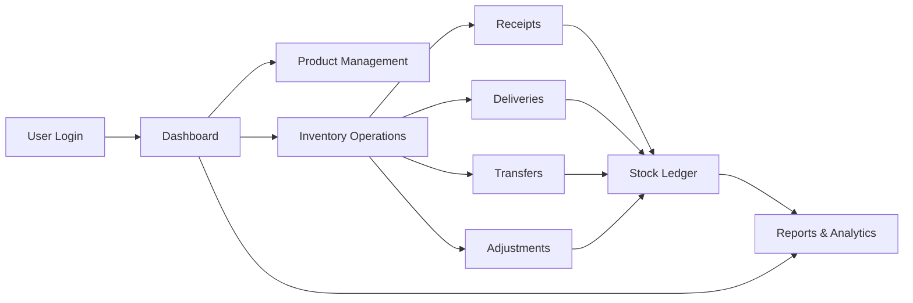

# 📦 StockMaster - Inventory Management System

StockMaster is a modern, real-time inventory management system designed to streamline stock operations for businesses. It replaces manual tracking methods with a centralized, easy-to-use application that supports multiple warehouses and provides comprehensive inventory control.

## 🎯 Project Overview

StockMaster digitizes and automates all inventory-related operations, providing:
- **Real-time stock tracking** across multiple locations
- **Automated inventory operations** (receipts, deliveries, transfers, adjustments)
- **Comprehensive reporting** and dashboard analytics
- **Role-based access control** for different user types

### 👥 Target Users
- **Inventory Managers** - Oversee all stock operations and management
- **Warehouse Staff** - Execute daily operations like picking, packing, and transfers

## 🚀 Core Features

### 🔐 Authentication & Security
- User registration and login
- OTP-based password reset
- JWT-based authentication
- Role-based access control

### 📊 Dashboard
- Real-time KPIs and metrics
- Total products in stock
- Low stock alerts
- Pending receipts and deliveries
- Scheduled internal transfers
- Dynamic filtering by document type, status, warehouse, and category

### 📦 Product Management
- Create and update products with SKU, category, unit of measure
- Stock availability per location
- Product categorization
- Reordering rules and alerts

### 🔄 Inventory Operations
| Operation | Purpose | Stock Impact |
|-----------|---------|--------------|
| **Receipts** | Incoming goods from suppliers | Increases stock |
| **Delivery Orders** | Outgoing goods to customers | Decreases stock |
| **Internal Transfers** | Movement between locations | Updates location only |
| **Stock Adjustments** | Correct inventory discrepancies | Updates to physical count |

## 🔄 System Workflow



### 📈 Reporting & Analytics
- Stock movement history
- Low stock alerts
- Multi-warehouse stock levels
- SKU search and smart filters

## 🛠 Tech Stack

### Frontend (This Repository)
- **React 18** with TypeScript
- **Vite** for fast development and building
- **Tailwind CSS** for styling
- **React Router** for navigation
- **Axios** for API communication
- **ESLint + TypeScript** for code quality

### Backend
- **Node.js + Express** - API server
- **MongoDB + Mongoose** - Database and ODM
- **JWT** - Authentication
- **bcryptjs** - Password hashing

## 📁 Project Structure

```
stockmaster/
├── public/                 # Static assets
├── src/
│   ├── components/         # Reusable UI components
│   │   ├── common/        # Header, Sidebar, Layout
│   │   ├── auth/          # Login, Register forms
│   │   ├── dashboard/     # KPI widgets, charts
│   │   ├── products/      # Product management
│   │   ├── operations/    # Receipts, deliveries, transfers
│   │   └── reports/       # Analytics and reports
│   ├── pages/             # Main application pages
│   ├── services/          # API service layer
│   ├── contexts/          # React contexts (Auth, Theme)
│   ├── hooks/             # Custom React hooks
│   ├── utils/             # Helper functions
│   ├── types/             # TypeScript type definitions
│   └── main.tsx           # Application entry point
├── package.json
├── vite.config.ts
├── tailwind.config.js
└── tsconfig.json
```

## ⚡ Quick Start

### Prerequisites
- Node.js 18+ 
- npm, yarn, or bun
- MongoDB (local or cloud)

### Installation

1. **Clone the repository**
```bash
git clone <repository-url>
cd stockmaster
```

2. **Install dependencies**
```bash
npm install
# or
yarn install
# or
bun install
```

3. **Environment setup**
Create a `.env` file in the root directory:
```env
VITE_API_BASE_URL=http://localhost:5000/api
VITE_APP_NAME=StockMaster
```

4. **Start development server**
```bash
npm run dev
# or
yarn dev
# or
bun dev
```

The application will open at `http://localhost:5173`

### Build for Production
```bash
npm run build
npm run preview  # Preview production build
```

## 🗃 Database Schema Overview

The system uses MongoDB with these main collections:
- **Users** - Authentication and user profiles
- **Products** - Product master data
- **Warehouses** - Location management
- **StockLedger** - Audit trail for all stock movements
- **Receipts** - Incoming goods documentation
- **DeliveryOrders** - Outgoing goods documentation
- **InternalTransfers** - Stock movement between locations
- **StockAdjustments** - Inventory correction records


## 📱 Key Pages & Navigation

1. **Dashboard** - Overview with KPIs and quick actions
2. **Products** - Product catalog and stock levels
3. **Operations** - Inventory movement management
4. **Move History** - Audit trail and transaction history
5. **Settings** - Warehouse and system configuration
6. **Profile** - User settings and logout

## 🎨 UI/UX Features

- **Responsive Design** - Works on desktop and mobile
- **Real-time Updates** - Live stock level changes
- **Intuitive Filters** - Easy data exploration
- **Clean Interface** - Minimalist, professional design
- **Accessibility** - WCAG compliant components

## 🔧 Development

### Code Style
- TypeScript for type safety
- ESLint for code quality
- Prettier for code formatting
- Component-based architecture

### API Integration
All API calls are centralized in the `services/` directory with proper error handling and TypeScript types.

### State Management
Uses React Context for:
- Authentication state
- Theme preferences
- Global loading states

## 🤝 Contributing

1. Fork the repository
2. Create a feature branch (`git checkout -b feature/amazing-feature`)
3. Commit your changes (`git commit -m 'Add amazing feature'`)
4. Push to the branch (`git push origin feature/amazing-feature`)
5. Open a Pull Request

## 📄 License

This project is licensed under the MIT License - see the LICENSE file for details.

## 🆘 Support

For support and questions:
- Check the documentation
- Open an issue on GitHub
- Contact the development team

---

**StockMaster** - Streamlining your inventory management, one stock movement at a time. 📦✨